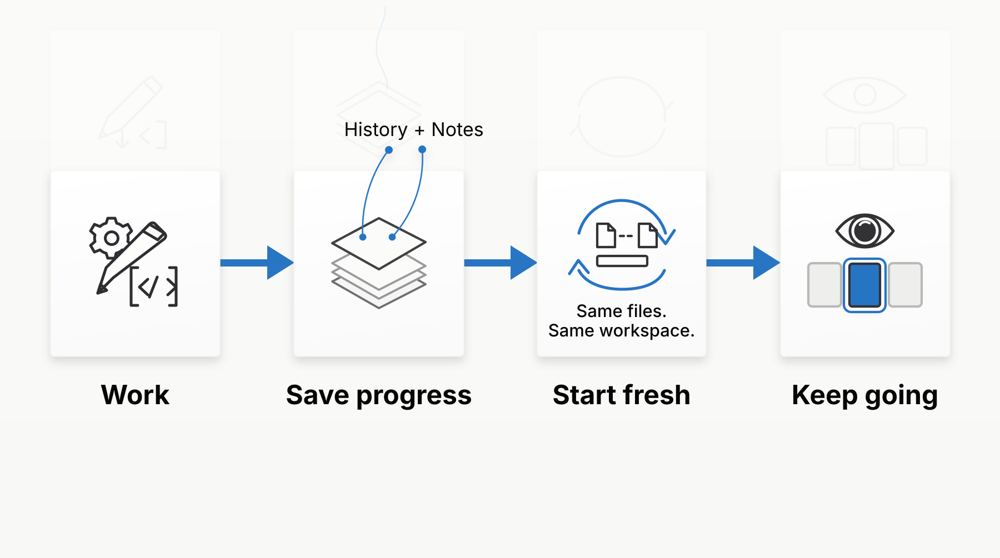

<div align="center">

# Claude Context Continuity


**Codex-style context continuity for native Claude Code.**

Keep long-running work moving with a context budget, a fresh start at the right moment, access to the original conversation, and short working notes.

[简体中文](README.zh-CN.md) · [Repository](https://github.com/macchen123/claude-context-continuity) · [License](LICENSE)

[](pyproject.toml)
[](LICENSE)
[](#platform)
[](https://linux.do)

<sub>Concept illustration — not a terminal screenshot.</sub>

</div>

[Why](#why) · [How it works](#how-it-works) · [Start in three steps](#quick-start) · [Everyday use](#everyday-use) · [Cron Workaround](#cron-compat) · [Advanced Features](#advanced) · [Privacy](#privacy) · [FAQ](#faq) · [Contributing](#contributing) · [Acknowledgments](#acknowledgments)

<a id="why"></a>
## Why Claude Context Continuity?

Claude Code natively provides `/compact` to summarize growing conversations. However, in complex or long-running tasks, repeatedly relying on summaries can introduce serious pain points:

- **Crucial details get dropped:** Strict constraints, architecture decisions, or edge cases established early on rarely survive multiple rounds of summary compression.
- **Drift and compounding errors:** Once key context is lost, the model tends to hallucinate or deviate, resulting in code that diverges from your initial specifications.
- **Workflow interruptions:** Waiting for compaction takes time, and rebuilding background context manually takes even more.

**Our approach: Inspired by Codex.**  
Instead of summarizing in-place, we monitor your token budget. When you approach the limit, we switch cleanly to a fresh context window while passing forward a concise handoff. The entire original history remains fully searchable locally. **Replace lossy compression with seamless context continuity.**

You keep your existing native Claude Code setup. This tool does not rebuild coding models or replace your tools. It is an independent community project inspired by Codex's [new-context mechanism](https://github.com/openai/codex/blob/rust-v0.153.4/codex-rs/core/src/tools/handlers/new_context_window_spec.rs) and [History/Notes tools](https://github.com/openai/codex/blob/rust-v0.153.4/codex-rs/ext/history-notes/src/tools.rs).

---

<a id="how-it-works"></a>
## How it works



<p align="center"><em>Concept flow — not a terminal screenshot.</em></p>

1. **Prepare before the limit:** Leaves room for a handoff before the conversation fills up, rather than stopping when space has already run out.
2. **Keep work moving:** Background tasks keep running. Messages sent during the switch and drafts you haven't submitted are kept, so you don't have to start over.
3. **Find details when you need them:** A short handoff goes to the new window; the original conversation stays available locally. Look up the details you need instead of relying only on a summary.

| With `/compact` | With Context Continuity |
| --- | --- |
| Compresses conversation in-place via summary | Switches cleanly to a fresh context window |
| Lossy: early constraints and details easily get lost | Carries key progress forward; exact history remains queryable |
| Prone to compounding errors over long runs | Stays in an optimal low-latency, high-accuracy context range |

---

<a id="quick-start"></a>
## Start in three steps

### 1. Requirements & Installation

Prerequisites: Python 3.10+, Git, `tmux`, and native Claude Code **2.1.266 or newer**. Run `claude --version` to check your installed version.

```sh
python3 -m pip install "git+https://github.com/macchen123/claude-context-continuity.git"
```

*Note: Installation does not modify your global Claude Code settings. All hooks and custom commands are loaded dynamically per session via a local plugin.*

### 2. Set Context Budget

Set your desired token ceiling based on your model's effective context capacity (e.g. 200k):

```sh
export CLAUDE_CODE_MAX_CONTEXT_TOKENS=200000
```

### 3. Launch

Run `cclaude` in place of your usual `claude` command:

```sh
cclaude
```

*(Optional: If you wish to disable native auto-compaction for this session, pass `DISABLE_COMPACT=1 cclaude`)*

---

<a id="everyday-use"></a>
## Everyday use

Work in your project directory exactly as you normally do with Claude Code.

When the conversation gets close to full, the tool opens a fresh context window and continues the current work. Background tasks keep running, messages sent during the switch are handled in the new window, and unfinished drafts are not sent.

If an automatic switch cannot proceed, the terminal tells you why. You can still carry on with your work and look up earlier history.

### Proactive rotation with `/renew`

If you've completed a milestone and want to start fresh immediately, type inside your session:

```text
/renew
```

The model drafts a quick handoff note and safely rotates to a new window. If another plugin occupies `/renew`, use `/cclaude:renew`.

---

<a id="cron-compat"></a>
## Scheduled Tasks (CronCreate) Bug Workaround

In official Claude Code releases, there is a known upstream issue: **Running `/clear` in a session can break session binding for newly created durable tasks (`CronCreate(durable=true)`), causing them to stay on disk without firing.**

Since rotating context involves session boundaries, this package includes a lightweight, reversible workaround enabled by default:
- It automatically aligns new durable tasks with the active scheduler session so they fire reliably.
- **Never modifies official binaries.** Tasks remain in the official `.claude/scheduled_tasks.json`, and native commands like `CronList` / `CronDelete` continue to work normally.

**Controls:**
- **Disable workaround** (e.g., after upstream officially fixes the issue):
  ```sh
  CCLAUDE_DURABLE_CRON_COMPAT=off cclaude
  ```
- **Inspect status:**
  ```sh
  claude-context cron-compat status --context-id "$CLAUDE_CONTINUITY_ID"
  ```
- **Revert modifications:**
  ```sh
  claude-context cron-compat restore --context-id "<context-id>"
  ```

---

<a id="advanced"></a>
## Advanced Features: History Search & Working Notes

When working in a fresh window, you can search across all previous session transcripts at any time:

```sh
# Search across all past context windows (powered by local SQLite FTS5)
claude-context history-search --query "database schema" --recent-first

# Inspect exact matched message content
claude-context history --source "<path>" --session-id "<id>" --message-id "<id>" --expected-sha256 "<hash>"

# Manage shared working notes
claude-context notes list
claude-context notes read plan
printf '%s' 'Milestone notes' | claude-context notes write plan
```

---

<a id="privacy"></a>
## Local Data & Privacy

All session records, notes, and search indices are stored strictly on your local machine:

```text
${CLAUDE_CONFIG_DIR:-$HOME/.claude}/session-continuity/
```

- **Local only:** No data is ever transmitted to third-party telemetry or cloud services.
- **Secret redaction:** Common secret environment variables (API keys, tokens) are stripped before writing to local index caches.
- **Model queries:** When you retrieve past history into the active conversation, it interacts directly with your configured Claude provider, exactly like normal Claude Code usage.

---

<a id="platform"></a>
## Platform Support

| Platform | Status |
| --- | --- |
| Python | 3.10+ (tested on 3.12) |
| macOS & Linux | Fully supported (requires `tmux`) |
| WSL | Functional (standard POSIX baseline) |
| Windows Native | Unsupported |

---

<a id="faq"></a>
## FAQ

### 1. Does this replace or disable native `/compact`?
No. Native `/compact` remains completely untouched. You can still invoke `/compact` manually whenever you choose.

### 2. Will the tool interrupt active commands or tasks?
It won't stop or rerun background tasks just to switch context. It waits for the current tool calls to finish, then switches; background tasks don't all have to be done. Messages sent during the switch are handled in the new window, and drafts are kept.

### 3. Can I still access details from earlier windows?
Yes. All prior sessions in the task chain are indexed locally in SQLite FTS5. Use `claude-context history-search` to query any previous turn or decision.

### 4. Does this alter Claude Code's models, prompts, or permissions?
No. You are still using native Claude Code. Your models, system prompts, MCP servers, and permission policies remain identical.

---

<a id="contributing"></a>
## Contributing

Contributions and feedback are welcome via GitHub Issues and Pull Requests.

To run tests locally:
```sh
python3 -m pip install -e .
CLAUDE_CONFIG_DIR="$PWD/.test-claude-config" \
PYTHONPATH=src \
python3 -m unittest discover -s tests -v
```

---

<a id="acknowledgments"></a>
## Acknowledgments

Thanks to the [LINUX DO](https://linux.do) community for its support and recognition.

## License

Claude Context Continuity is released under the [MIT License](LICENSE).
